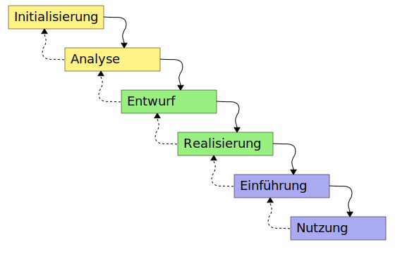
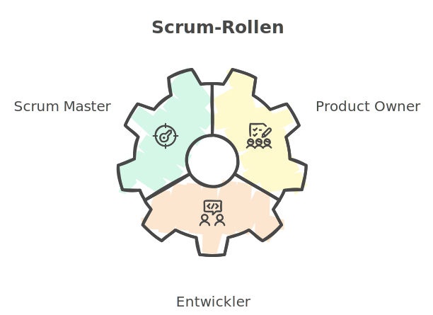

:doctype: book
:toc: macro
:source-highlighter: rouge
:icons: font
// Lade die entsprechende Kopfzeile (kopfzeile_diplomarbeit_aul, ..._hif oder ..._kolleg)
:header_image: kopfzeile_diplomarbeit_aul.png
:pdf-page-size: a4
:toc-title: Inhaltsverzeichnis
:lang: DE
:hyphens:

toc::[]

<<< 
== Themenstellung von Sebastian Stiller

[.lead]
Vergleich klassischer und agiler Projektmanagement-Methoden: Effizienz, Flexibilität und Praxistauglichkeit in modernen IT-Projekten

=== Einleitung

In unserer heutigen Welt, in der wir uns als Menschen immer schneller weiterentwickeln müssen, ist es immer wichtiger, nicht nur für Unternehmen, sondern für alle Menschen, ihre Projekte so effizient und flexibel wie möglich zu organisieren. Stetig wechselnde Anforderungen und Umstände machen es nötig, dass die Art, wie ein Projekt organisiert wird, ebenfalls immer flexibler und effizienter wird. Hierdurch stellt sich immer wieder die Frage: Was ist heutzutage besser? Klassisches hierarchisches oder modernes und agiles Projektmanagement?

=== Klassisches Projektmanagement: Das Wasserfallmodell 

Im klassischen Projektmanagement sind die Rollen klar geregelt und jeder hat seine Aufgabe im Projekt. Eines der berühmtesten Modelle zum *"klassischen"* Projektmanagement ist das Wasserfallmodell (vgl. <<classic, 1>>)

==== Beschreibung der Methode 

Bei dem Wasserfallmodell handelt es sich um ein sequentielles Vorgehensmodell, welches in Phasen eingegliedert ist. Das Modell ist sequenziell aufgebaut, gemeint ist damit, dass die einzelnen Phasen des Projektes größtenteils nacheinander abgearbeitet werden müssen, um das Projekt erfolgreich abzuschließen. Das Modell wird deshalb als Wasserfall bezeichnet, da die Darstellung einem Wasserfall sehr stark ähnelt. (vgl. <<wasserfall, 2>>) 

==== Phasen des Wasserfallmodells (vgl. <<phasen_wasserfall, 4>>) 

Das Wasserfallmodell besteht aus sechs Phasen, welche sequentiell durchlaufen werden müssen. Die Phasen sind: 

(img. <<wasserfall_svg, 1>>)

===== Anforderungsanalyse 

In dieser Phase werden die Anforderungen an das Projekt gesammelt und dokumentiert. Wichtig ist, dass alle Anforderungen und Ziele des Projektes und die Organisation klar, deutlich und für alle Parteien verständlich formuliert sind um Missverständisse oder Interpretationsspielraum nicht aufkommen zu lassen. 

Eine gute Herangehensweise ist es, die Ziele des Projektes mit Hilfe des SMART-Abfrageschemas zu formulieren. 

**S**pezifisch: Die Ziele sollten klar und eindeutig formuliert sein. +
**M**essbar: Die Ziele sollten eine messbare Komponente enthalten, um einen Projektfortschritt erfassen zu können +
**A**ttraktiv: Die Ziele sollten für alle Beteiligten attraktiv und motivierend sein. +
**R**ealistisch: Die Ziele sollten realistisch und erreichbar sein. +
**T**erminiert: Die Ziele sollten einen klaren Zeitrahmen haben, um den Fortschritt des Projektes zu verfolgen. +
(vgl. <<smart, 3>>)

===== Entwurf

In dieser Phase wird das Konzept für das Projekt erstellt. Hierbei werden die Anforderungen und Ziele des Projektes in ein machbares Konzept umgesetzt. Zuerst wird eine Machbarkeitsanalyse durchgeführt um zu prüfen, ob die Ziele des Projektes mit den vorhandenen Ressourcen erreicht werden kann. Anschließend wird mit diesen Ergebnissen ein Konzept erstellt, welches die Anforderungen und Ziele enthält, welche mit einer höheren Sicherheit erreicht werden können. 

====== Ressourcen 

Ressourcen sind generell alle Mittel, die für die Erfüllung eines Projektes zur Verfügung stehen. 
Diese Ressourcen werden generell in drei Kategorien eingestuft: +
* **Personelle Ressourcen**: Alle Personen, die an dem Projekt beteiligt sind. Hierzu zählen sowohl die Projektmitarbeiter, als auch die Stakeholder und das Management. +
* **Sachliche Ressourcen**: Alle Werkzeuge, Maschinen, Materialien, Infrastruktur und Software-Tools, welche für eine reibungslose Abwicklung des Projektes zur Verfügung stehen. +
* **Finanzielle Ressourcen**: Das ist das Budget, also das Geld, welches oft vom Auftraggeber oder oberen Management zur Verfügung gestellt wird, um das Projekt zu finanzieren. Hierbei ist es wichtig, dass das Budget immer eher höher angesetzte wird, als eigentlich erforderlich ist, da man nie genau von Anfang an mit 75%iger Sicherheit sagen kann, ob nicht etwas unvorhergesehenes eintritt und das Budget übersteigt. Eine Regel an dieser Stelle ist grundsätzlich Murphy´s Gesetz. Dieses beschreibt, dass auch wenn man glaubt alles bedacht zu haben, wird immer etwas passieren, was die Planung über den Jordan gehen lässt. 

==== Implementierung

Das ist die eigentliche Arbeit am Projekt. Hier werden die Anforderungen und Ziele des Projektes nach den Qualitätsstandards des Projektes so umgesetzt, wie es im Konzept vom Auftraggeber abgesegnet wurde. In dieser Phase wird also das Produkt erstellt, welches am Ende des Projektes vom Auftraggeber abgenommen und an den Kunden übergeben wird. Hier ist es wichtig regelmäßige Meetings mit dem Auftraggeber und den Stakeholdern zu haben, um den Fortschritt des Projektes zu überwachen und gegebenenfalls Maßnahmen zu ergreifen, wenn etwas nicht nach Plan läuft. Ein gutes Hilfsmittel hierfür ist der Statusbericht mit einer Meilensteintrendanalyse. Hierbei wird der Fortschritt des Projektes anhand der Meilensteine des Projektes dokumentiert und es wird geschaut, ob die Meilensteine im Zeitplan liegen oder ob es zu Verzögerungen oder Vorsprüngen kommt. 

==== Test 

In dieser Phase wird das Produkt, welches in der Implementierungsphase erstellt worden ist, auf die funktionalen und qualitativen Anforderungen des Projektes getestet. Hier wird geprüft, ob das Produkt den Anforderungen und Zielen des Projektes, welche vom Auftraggeber vorgegeben wurden, entspricht. Hierbei ist es wichtig, dass die verschiedenen Abschnitte des Produktes einzeln getestet werden und anschließend das gesamte Produkt und das Zusammenspiel der einzelnen Abschnitte miteinander getestet wird. Dies wird oft in der Form von Komponententests, Integrationstests und Systemtests durchgeführt. 
Zu jedem dieser Tests muss ein Testprotokoll erstellt werden, welches die Anforderungen und Ergebnisse der Tests dokumentiert. Diese Protokolle sind wichtig, um später nachweisen zu können, dass alle Anforderungen und Qualitätsstandards des Produktes, welche vom Auftraggeber vorgegeben wurden, erfüllt sind. Dies ist wichtig, um sagen zu können, dass das Produkt bei der Übergabe an den Kunden keine Mängel aufweist. 

==== Abnahme

Bei der Abnahme wird das Produkt vom Auftraggeber auf die Erfüllung der Qualitätsanforderungen und der Ziele des Projektes geprüft. Hierbei wird das Produkt auf die Funktionalität, die Qualität und die Erfüllung der Anforderungen getestet. Wenn das Produkt diesen Anforderungen entspricht, wird es vom Auftraggeber abgenommen und zur Inbetriebnahme oder zur Übergabe an den Kunden freigegeben. Hierbei ist es wichtig, ein Abnahmeprotokoll zu erstellen, welches dokumentiert, welche Anforderungen und Qualitätsmerkmale das Produkt aufweisen muss, um abgenommen zu werden. Des Weiteren wird in diesem Protokoll dokumentiert, welche Anforderungen und Qualitätsmerkmale das Produkt tatsächlich erfüllt oder nicht erfüllt. Abschließend wird das Protokoll vom Auftraggeber und dem Projektleiter unterschrieben, um von beiden Parteien zu bestätigen, dass das Produkt den Anforderungen und Qualitätsmerkmalen eben entspricht oder nicht entspricht und welche Maßnahmen gegebenenfalls ergriffen werden müssen, um das Produkt den Anforderungen und Qualitätsmerkmalen anzupassen und dadurch die Abnahme erfolgreich durchzuführen. Ist dies der Fall, wird das Produkt an den Kunden übergeben und das eigentliche Projekt gilt als abgeschlossen. 

==== Inbetriebnahme

In dieser Phase, welche grundsätzlich nicht mehr in die eigentliche Projektarbeit fällt, wird das Produkt in Betrieb genommen und kommt somit in den produktiven Einsatz. Hierbei kommt es oft zu Einschulungen und Workshops, um die Mitarbeiter des Kunden mit dem Produkt vertraut zu machen und die mögliche Umstellung von einem alten Produkt auf das neue zu gewährleisten. Hierbei ist es wichtig, dass die Mitarbeiter des Kunden das neue Produkt verstehen und damit arbeiten können. Oftmals werden auch Schulungsunterlagen erstellt, um den Mitarbeitern des Kunden die Arbeit mit dem neuen Produkt zu erleichtern.

(vgl. <<phasen_wasserfall, 4>>) 

==== Rollen und Verantwortlichkeiten 

Im klassischen Projektmanagement sind die Rollen und Verantwortlichkeiten klar und Hierarchisch geregelt. Grundsätzlich gibt es neun Rollen, welche in einem "klassisch" geführtem Projekt vorkommen können. Hier ist jedoch zu beachten, dass viele dieser Rollen bei kleineren Projekten nicht vorkommen oder vom Projektleiter übernommen werden. 
Diese Rollen sind: +
* **Projektauftraggeber**: Der AuftraggeberIn ist die Person oder Organisation, die das Projekt in Auftrag gibt und die finanziellen Mittel bereitstellt. Er ist derjenige der als einziger sagen kann ob das Projekt geglückt ist oder als gescheitert wird und somit als Verlust abgeschrieben wird.  +
Er ist derjenige, welcher gewisse Dokumente, wie Projektauftrag, Lasten und Pflichtenheft und das Abnahmeprotokoll absegnet und somit die Grundlage für das Projekt schafft. +
* **Projektleiter**: Der Projektleiter/Die Projektleiterin ist die Person, die das Projekt leitet und die Verantwortung für die Planung, Durchführung und Kontrolle des Projektes trägt. Er ist derjenige, welcher das Projektteam führt und die Kommunikation zwischen dem Auftraggeber und dem Projektteam sicherstellt. +
* **Der Teilprojektleiter/Abschnittsleiter**: Der Teilprojektleiter oder auch als Abschnittsleiter bezeichnet, ist ein Teammitglied, welches, gerade bei sehr großen Projekten mit vielen Abschnitten, die Verantwortung für seinen Abschnitt des Projektes trägt. Er ist also eine Verlängerung des Projektleiters und hat die gleichen Aufgaben und Privilegien wie der Gesamtprojektleiter, jedoch eben nur für seinen Abschnitt des Projektes. Diese Rolle ist vor allem wichtig, wenn die einzelnen Abschnittsteams nicht direkt mit dem Projektleiter kommunizieren oder das Projekt eine Größe aufweist, bei der es für den Projektleiter nicht mehr zumutbar ist, alle Teammitglieder zu führen. Diese Rolle fällt bei kleineren Projekten generell weg. +
* **Der Qualitätsmanager**: Der QualitätsmanagerIn ist die Person in einem Projektteam, welche die Verantwortung für die Qualität des Endproduktes trägt. Er ist also dafür verantwortlich, dass das Produkt den Anforderungen und Qualitätsmerkmalen des Projektauftraggebers entspricht und die Abname des Produktes sichergestellt werden kann. Er kontrolliert laufend die Qualität des Produktes und kann bei Bedarf Maßnahmen ergreifen, um die Qualität des Produktes, laut Lastenheft sicherzustellen. +
* **Der Projektkaufmann**: Der Projektkaufmann/Die Projektkauffrau ist die Person im Projektteam, welche das Budget des Projektes verwaltet und vor allem überwacht. Er stellt also sicher, dass das Projekt im Rahmen des Budgets bleibt und somit ein scheitern des Projektes aufgrund von wegfallenden Finanziellen Ressourcen nicht eintritt. In dieser Rolle muss der PKM immer das Budget im Auge behalten und wenn nötig, Maßnahmen ergreifen, um entweder das Budget zu erhöhen, die Kosten zu senken oder das Projekt als gescheitert zu erklären, wenn das Budget nicht mehr gerettet werden kann. +
* **Der Projektcontroller**: Ähnlich wie der Projektkaufmann, ist der Projektcontroller/Die Projektcontrollerin dafür verantwortlich, dass das Projekt zustande kommt. Der Unterschied ist, dass der Projektcontroller/Die Projektcontrollerin nicht das Budget im Auge hat, sondern die Termine und Meilensteine des Projektes. Er ist also für den generellen Fortschritt des Projektes verantwortlich und stellt sicher, dass das Projekt zum ausgemachten Zeitpunkt fertiggestellt werden kann. Hierbei ist es wichtig zu erwähnen, dass der Projektcontroller/Die Projektcontrollerin ebenfalls das Projekt als gescheitert erklären kann, wenn die Termine und Meilensteine unter keinem Umstand mehr eingehalten werden können. Die Finale Entscheidung obliegt in beiden Fällen (Budget und Termine) jedoch immer dem Projektleiter bzw. dem Projektauftraggeber. +
* **Die Projektbüromitarbeiter**: Die Projektbüromitarbeiter/Die Projektbüromitarbeiterin ist die Person im Projektteam, welche die administrativen Aufgaben des Projektes übernimmt. Hierzu zählen unter anderem die Dokumentation des Projektes, die Erstellung von Protokollen und Berichten, die Organisation von Meetings und die Kommunikation mit dem Auftraggeber und den Stakeholdern. Sie sind also für die gesamte Bürokratie verantwortlich und haben somit eine der **wichtigsten** Aufgaben, da die Dokumentation des Projektes vor allem aufgrund der rechtlichen Konsequenzen wichtig ist, wenn entweder die Dokumentation nicht vollständig ist oder etwas darin steht, was nicht der Wahrheit entspricht. +
* **Der Fachausschuss**: Der Fachausschuss ist die Zusammenkunft von Experten, welche aus allen beteiligten Abteilungen des Projektes besteht. Diese Experten sind für die fachliche Beratung des Projektteams verantwortlich und stellen sicher, dass das Projekt den fachlichen Anforderungen entspricht. Eine der wichtigsten Bereiche des Fachausschusses ist die Rechtsabteilung, Logistikabteilung. Diese beiden Bereiche sind wichtig, da sie in der Regel die meisten Probleme in einem Projekt verursachen können und wo sich das Projektteam am wenigsten auskennt. Der Fachausschuss ist also eine Art Expertenrat, welcher dem Projektteam beratend zur Seite steht und bei Bedarf auch Entscheidungen treffen kann, wenn es um fachliche Fragen geht. +

===== Projektrollen Light (Abgespeckt)

Bei kleineren Projekten, welche nicht die Größe und Komplexität eines großen Projektes aufweisen, werden oft nicht alle Rollen benötigt oder können zusammengefasst werden. Daraus resultiert die folgende Liste: 

* **Projektauftraggeber**: Diese Rolle bleibt immer gleich, da der Auftraggeber die Person ist, ohne die kein Projekt zustande kommt. +
* **Projektleiter**: Diese Rolle ist ebenfalls immer gleich, da der Projektleiter/die Projektleiterin die Person ist, welche das Projekt leitet und die Verantwortung für die Planung, Durchführung und Kontrolle des Projektes trägt. +
* **Projektteammitglied**: Diese Rolle ist einfach gesagt die Person, welche die eigentliche Arbeit am Projekt verrichtet. Sie ist also für die Umsetzung der Anforderungen und Ziele des Projektes verantwortlich. + 
* **Projektmitarbeiter**: Diese Rolle ist im Grunde der Fachausschuss. 

==== Vor- und Nachteile (vgl. <<agile_3, 7>>)

Grundsätzlich hat alles seine Vor- und Nachteile. Das Wasserfallmodell ist hierbei keine Ausnahme. +

===== Vorteile 
**Klarheit und Struktur**: Das Wasserfallmodell bietet aufgrund seiner klaren hierarchischen Struktur eine hohe Klarheit und Struktur im Projektablauf. Alle Rollen und Verantwortlichkeiten sind klar definiert und es gibt sehr wenig Interpretationsspielraum. Jeder Beteiligte weiß genau, was er zu tun hat und welche Aufgaben er zu erfüllen hat. Dies führt zu einer hohen Effizienz im Projektablauf. +
**Sicherheit**: Durch die klaren Anforderungen und Ziele des Projektes, welche in der Anforderungsanalyse, dem Lastenheft und final im Pflichtenheft festgehalten werden, ist das Wasserfallmodell sehr sicher. Wenn alle Ziele und Anforderungen dem SMART-Abfrageschema entsprechen, ist die Wahrscheinlichkeit für Interpretationsspielraum sehr gering und somit auch die Wahrscheinlichkeit für Missverständnisse und Fehler im Projektablauf. +
**Zeitplansicherheit**: Dadurch dass das Wasserfallmodell ein sequentielles Vorgehensmodell ist, ist der Zeitplan des Projektes sehr sicher. +

===== Nachteile 
**Unflexibilität**: Das Wasserfallmodell ist aufgrund der starren Struktur beim Wegfall von Teammitgliedern sehr unflexibel. Die Reaktionsfähigkeit bei solchen Ereignissen ist daher beeinträchtigt. 

**Geringe Fehlererkennungsfähigkeit**: Aufgrund der fixen Berichtszyklen werden Fehler oft erst sehr spät erkannt und können dann nur schwer behoben werden, ohne Verzögerungen im Projektablauf zu verursachen. 

**Hohe Komplexität**: Das Wasserfallmodell ist nicht geeignet für sehr komplexe Projekte, da man hier oft keine oder nur eine sehr geringe Planungssicherheit aufweisen kann. 

**Hoher Dokumentationsaufwand**: Das Wasserfallmodell erfordert eine Vielzahl an Dokumenten, welche für die Durchführung des Projektes notwendig sind. Diese Dokumente müssen erstellt, gepflegt und aktualisiert werden. Zusätzlich müssen diese Dokumente so geschrieben werden, dass sie für alle Beteiligten verständlich sind. Dies bedeutet, wenn das Projekt über mehrere Jahre und mit wechselnden Teammitgliedern und Stakeholdern aus möglicherweise verschiedenen Ländern durchgeführt werden soll, wächst die Dokumentation und muss auch übersetzt werden, wodurch die Dokumentation sich immer verdoppelt und der Aufwand immer komplizierter wird. 

**Keine Iterativität**: Das Wasserfallmodell ist ein sequentielles Verfahren, welches keine Iterationen vorsieht. Damit gemeint ist, dass es keine Möglichkeit für Feedback- oder Korrekturschleifen gibt. Ein tatsächliches Feedback ist erst nach der Beendigung des Projektes möglich, was zu einem erhöhten Risiko für Fehler und Unstimmigkeiten führt. 

**Ausfallvulnerabilität**: Wenn ein Teammitglied ausfällt (Krankheit, Unfall oder Ausscheiden aus dem Projekt) kann das Projekt ins Stocken bringen und somit eine Zeitverzögerung hervorrufen. Dies hat den Grund da eine Kompensation sehr kompliziert werden kann (vor allem später im Projekt) da Arbeitspakete Reevaluiert werden müssen um se gegebenenfalls an andere Teammitglieder umzuverteilen oder aus dem Projekt zu streichen.

=== Agiles Projektmanagement: Scrum und Kanban

Gerade in der IT-Branche und in der Softwareentwicklung oder bei Projekten, die eine Hohe Flexibilität und Anpassungsfähigkeit erfordern, hat sich ein neueres Modell des Projektmanagements etabliert. Dieses Modell ist das Agile Projektmanagement. Hierbei gibt es nicht nur eine Methode, sondern Mehrere, wie zum Beispiel Extreme Programming (XP), Feature-Driven Development (FDD), Dynamische Systementwicklung (DSDM).

==== Beschreibung der Methode

Beim agilen Projektmanagement handelt es sich, anders als bei der klassischen Projektmanagementmethode, um eine moderne Variante, deren Ursprung bereits im Jahr 1957 liegt, damals jedoch nur teilweise, aber ab 1970 dann erst wirklich relevant wurde, vor allem im Bereich der Softwareentwicklung. Hierbei arbeiten die Teams in kurzen, aber konzentrierten Projekteinheiten, um flexibel auf Veränderungen reagieren zu können.

==== Phasen des Agilen Projektmanagements
image::scrum_Process.svg[width=75%]
(img. <<scrum_process_svg, 3>>)

Beim Scrum Framework wird das Projekt in sogenannte Sprints eingeteilt. Diese Sprints sind also ähnlich der Berichtszyklen im klassischen Projektmanagement.
Dennoch gibt es vier essentielle Bestandteile welche hier ihre Verwendung finden. Diese Bestandteile sind *das Product Backlog*, *das Sprint Backlog*, *der Sprint* und *das Working Increment of the Product*. Durch diese Bestandteile(Stufen) werden die einzelnen Arbeitspakete durchgeführt und das anhand ihres Fertigstellungsgrades oder Ihrer Priorität.

===== Product Backlog 

Das *Produkt Backlog* ist der *Aufgabenpool* des gesamten Projektes. Hier befinden sich alle Aufgabenpakete welche im *gesamten* Projekt anfallen. Es zeigt also den Gesamtfortschritt des Projektes auf. Je weniger Aufgaben im Product Backlog vorhanden sind desto weiter ist das Projekt vorangeschritten. Neue Aufgaben, welche während des Projektverlaufs aufkommen landen automatisch hier und werden hier im Sinne ihrer Priorität evaluiert und eingestuft. Mit dieser Einstufung wird dann überlegt wann im Verlauf der nächsten Stufe das Arbeitspaket bearbeitet wird.

===== Sprint Backlog

Das *Sprint Backlog* ist ähnlich des *Product Backlog* ein Aufgabenpool der die Aufgabenpakete für den Sprint sammelt. Hier befinden sich also alle Aufgaben welche im *aktuellen* Sprint anfallen. Ist diese Hürde genommen wird ein Arbeitspaket durch einen Entwickler abgearbeitet und entsprechen fertiggestellt. Es stellt also die nächst höhere Stufe dar und hier wird weniger auf Priorität geachtet sondern auf die Reihenfolge. Diese Hürde ist aber nicht entgültig und wenn es notwendig ist kann auch während des Sprints eine Reevaluierung stattfinden und ein Arbeitspaket kann wieder im Sprint Backlog landen. Eine Rückstufung in das Product Backlog ist zwar selten aber nicht unmöglich.

===== Sprint

Der *Sprint* ist die Eigentliche Arbeitszeit in der Die Arbeitspakete Abgearbeitet werden. Dieser Sprint hat eine fix definierte Länge von bis zu 30 Tage (längere Sprints sind nicht ideal). Nach diesen 30 Tagen gibt es ein Meeting mit allen Beteiligten (*Product Owner*, *Scrum Master* und *dem Team*) und es wird geschaut was wurde erledigt, was ist noch offen und wo gab es möglicherweise Probleme gibt welche Angesprochen werden müssen. Dieses Meeting wird auch als *Sprint Review* bezeichnet. Nach Beendigung dieses Meetings beginnt der Nächste Sprint und das ganze Prozedere wird wiederholt. Innerhalb des Sprints  gibt es einen weiteren Zeitraum der wichtig ist. Denn während eines Sprint gibt es alle 24 Stunden ein Meeting, genannt Daily Stand-Up, bei welchen das Team intern abspricht was jeder an diesem Tag erreichen möchtem, was er am Gestrigen Tag geschafft hat, was er nicht geschafft hat und wo es möglicherweise Probleme gab. Auf Grundlage dieser Beiden Meetings wird der Projektfortschritt gemessen. 

===== Working increment of the Product (WIP)

Der *Working increment of the Product (WIP)* oder auch *Work in Progress* stelt den Fertigstellungsgrad des Produktes dar. Hier landen also alle fertigen Arbeitspakete aus den Sprints. Es wird also bei jedem Sprint Meeting der Vergleich zwischen Product Backlog, Sprint Backlog und WIP gemacht und das Ergebnis dieses Vergleiches ist dann der Status des Projektes. Am Ende des Projektes ist dann also das Fertige Produkt der Inhalt dieser Stufe. Grundsätzlich ist es so, dass Arbeitspakete die einmal im *WIP* sind werden nicht mehr angerührt und sind daher immer Vollständig. Wenn also z.B. der Produkt Owner sich eine weitere Funktion wünscht von einem Arbeitspaket welches bereits im *WIP* ist so wird dieses nicht raus genommen sondern es wird ein komplett neues Arbeitspaket gemacht welches mit diesem in Relation gestellt wird. Dieses Neue Arbeitspaket durchläuft dann einmal den kompletten Evaluierungsprozess und kann sogar wenn es vom Team so eingestuft wird zur Gänze abgelehnt werden. Das bedeutet die Funktion kann oder wird nicht implementiert.

==== Rollen und Verantwortlichkeiten 

(img. <<scrum_rollen_svg, 2>>)

Da es keine einheitliche Definition für agiles Projektmanagement gibt, sondern verschiedene Frameworks wie zum Beispiel *Scrum*. In diesem Framework werden drei große Rollen vergeben:

**1. Produkt Owner** 

Der Product Owner ist die Interessensvertretung des Kunden im Projekt. Er ist also der Auftraggeber und kann auch derr Kunde selbst sein. Seine Aufgaben sind es Das Backlog zu verwalten und zu überlegen welche Tasks möglicherweise zuerst erledigt werden müssen. Er ist auch dafür verantwortlich, dass das Produkt in der höchst möglichen Qualität erstellt wird, da er effektiv gesehen für das Produkt zahlt. Der Product Owner ist auch für die *Sprint*-Abnahme verantwortlich. +

**2. Scrum Master** 

Der Scrum Master ist als Unterstützung für das Team da. Er achtet darauf, dass die Richtigen Verfahren angewandt werden. Er Organisiert die Projektmeetings, beschafft Räumlichkeiten und ist für die Anschaffung von benötigter Software und Hardware. Er ist zusätzlich auch eine Unterstützung des Product Owners. Einfach gesagt der Scrum Master übernimmt die Aufgaben eines Projektleiters und des Prokjektbüromitarbeiter (Operative und Bürokratische Verwaltung des Projektes) und ist somit Essentiell für das voranschreiten des Projektes. Der Scrum Master sorgt auch für die Einhaltung der Scrum-Prinzipien und kann entsprechend nachschärfen wenn es zu Missverständissen dahingehend kommt. 

**3. Team** 

Das Team (oder auch die Entwickler) ist der Kern des Projektes. Sie sind die Boots-on-the-Ground Worker. Sie machen die eigentliche Arbeit für die Erarbeitung des Produktes also die Bauarbeiter der Software. Sie sind also die Personen die das Produkt nach den Vorgaben des Produkt Owners und in einer Weise, welche den Scrum-Prinzipien entspricht und vom Scrum Master vorgegeben wird. Sie teilen sich die Verantwortung für das Scheitern oder den Erfolg des Projektes. Das Team ist auch für die verschiedenen Aspekte des Projektes (Analyse, Entwurf, Entwicklung, Tests und Dokumentation) verantwortlich. Das Team besteht je nach größe des Projektes aus mehreren Personen und verwaltet sich grundsätzlich intern.    

==== Vor- und Nachteile (vgl. <<agile_3, 7>>) +

Auch beim Agilen Projektmanagement gibt es (auch wenn es die modernere Variante ist) Vor- und Nachteile.

===== Vorteile
**Zeitliche Anpassbarkeit**: Grundsätzlich ist beim Agilen Projektmanagement kein exaktes Enddatum festgelegt. Es ist also variable wann das Projekt tatsächlich zu einem Ende kommt. Dadurch fällt der Druck den ein Fixes Enddatum bietet weil man nicht die ganze Zeit im Hinterkopf behalten muss. 

**Kundenmitsprache**: Der Kunde hat aufgrund der Sprint Reviews die Möglichkeit auch während dem Projektverlaufes Fragen, Wünsche, Anregungen oder Beschwerden vorzubringen und muss nicht hoffen, dass das Endprodukt dem Entspricht was er möchte. Es ermöglicht auch die Vorzeitige Beendigung des Projektes (wenn nicht mehr gewollt, Finanzierungsprobleme oder der Kunde nicht mehr existiert (z.B. in Konkurs geht)).

**Flache Hierachie und Motivation**:  Aufgrund der flacheren Hierachie (Das Team teilt sich den Kern der Verantwortung untereinander) ist die Motivation im Team weil man sich sein eigenes Tempo wählen kann und somit auch hier der Druck ("Ich muss das jetzt bis xxx machen") fällt.  

**Höhere Kundenzufriedenheit**: Da der Kunde mehr direkter in das Projekt integriert ist und eine deutlich ausgeprägtere Kommunikation zwischen Team und Kunde (und Stakeholder) stattfindet ist dieser am Ende deutlich Zufriedener und hat auch selbst weniger Stress (Angst ob Produkt wirklich das ist was er möchte). Er ist also um einiges weniger Angespannt als anders vielleicht.

**Iterativität**: Dadurch dass, gerade bei Scrum, das Projekt laufend Reevaluiert werden kann ist eine bessere Reaktionszeit möglich. Hierdurch kann man auch besser auf Unvorhergesehenes reagieren und somit ein Scheitern des Projektes verhindern. 

**Ausgeprägtere Kommunikation**: Da das ganze Konzept auf Kommunikation beruht gibt es weniger Spielraum für Interpretationen, da man bei Fragen leichter entweder den Product Owner oder Kunden kontaktieren kann und somit die benötigten Informationen leichter erhalten werden.

===== Nachteile

**verminderte Dokumentation**: Aufgrund des Verringerten Dokumentationsaufwandes beim Agilen Projektmanagement ist eine Rechtfertigung schwerer möglich. Das bedeutet wenn am Ende des Projektes doch Fragen oder Missverständnisse aufkommen sind die Handlungen des Teams während des Projektes deutlich schwerer möglich als bei der Klassischen Methodik.

**Kein fixes Endergebnis**: Da das Produkt im Laufe des Projektes sich vielleicht mehrmals ändert (entweder durch zusätzliche oder weniger Funktionen) ist nicht lässt sich kein eindeutiges und Fixes Endergebnis festlegen. Einzig ein grundsätzlicher Funktionsvorschlag kann vorgebracht werden. 

**erschwerte Langfristigkeit**: Langfristige Projekte erfordern ein erhöhtes Maß an durchaus genauer und Penibler Planung bis ins kleinste Detail. Dies ist aufgrund der Iterativität und Inkremtierten Bereitstellung des agilen Projektmanagements schwer oder garnicht möglich, da agiles PM nur kurzfristig eine genaue Planung ermöglicht was langfristig zu komplikationen führt. 

=== Vergleich der Methoden 

Um beide Methoden effektiv zu vergleichen muss man sich zuerst anschauen was die größten Unterschiede beide Methodiken aufweisen und in welchen Bereichen welche Methodik am besten angewendet wird. Erst dann kann man einen exakten Vergleich anstellen. Weiters ist zu sagen das keine der Methodiken besser ist als die andere sondern es Situationsbedingt ist ob man lieber "klassisch" oder  agil vorgeht. Dann gibt es noch zu sagen, dass kein Projekt 100%ig "klassisch" oder 100%ig agil geführt wird es handelt sich in der Regel in den meisten Fällen um eine Mischform. 

==== Unterschiede

===== 1. Iterativität

Einer der größten Unterschiede zwischen "klassischem" Projektmanagement und agilem Projektmanagement ist und bleibt die Iterativität. Diese Bedeutet das innerhalb des Projektes eine "Phase" immerwieder Durchlaufen wird und nach Jedem Durchlauf eine Reevaluierung der Projektziele stattfindet. Der Begriff findet hierbei hauptsächlich in der Softwareentwicklung gebrauch und beschreibt dort das wiederholte durchlaufen einer Methode (z.B. in einer Schleife) um auch hier nach jedem Durchlauf eine Reevaluierung eines Maßgeblichen Parameters(z.B. die Frage ob der Inhalt eines Warenkorbes den Maximal zulässigen Warenwert erreichthat) zuzulassen. Dies ist jedoch muss bei Langfristigen Projekten nicht immer ein Nachteil sein, da man so immer Evaluieren kann ob ein Aspekt noch benötigt wird oder ob möglicherweise Maßnahmen getroffen werden um das Projekt wieder in eine Bestimmte Richtung zu Lenken.

===== 2. Dokumentationsaufwand

Bei einem "klassisch" geführten Projekt steht die ausführliche und Stichhaltige Dokumentation immer im Vordergrund. Dies hat den Grund das diese Dokumentation oft der *einzige* Rechtfertigungsgrund darstellt. Das wird vorallem dann wichtig wenn das Projekt scheitert, da zwischen dem Kunden und dem Projektteam grundsätzlich ein Kooperationsvertrag geschlossen wird und dieser in den meisten fällen eine je nach dem wie Kritisch die Fertigstellung des Produktes ist eine Vertragsstrafe durchaus normal ist. Diese macht oft ein Vielfaches des Projektwertes aus. Um also zu verhindern, dass man möglicherweise diese Strafe zahlen muss (was gerade für ein kleines Team den Ruin bedeuten kann) ist eine Lückenlose und Schlüssige Dokumentation durchaus wichtig. 

Im agilen Projektmanagement wird dies dezent durch die direkte Entscheidungsfindung und Beteiligung des Kunden am Projekt abgefedert, da hier der Kunde selbst eine gewisse Verantwortung am Erfolg oder Misserfolg am Projekt trägt und auch immer wieder verlauten kann wenn er etwas am Projektinhalt ändern möchte. Das heißt die Rechtfertigungspflicht liegt hier nicht ausschließlich beim Projektteam sondern teilt sich zwischen den einzelnen Parteien (Kunde, Product Owner, Stakeholder, Scrum Master und Entwickler) auf. 

Auch die Anzahl an Dokumenten die benötigt werden unterscheidet sich Grundlegend. So braucht man bei einem "klassisch" geführten Projekt zum einen ein Projekthandbuch (enthält alle Relevatnten Aspekte des Projektes und wird über das gesamte Projekt adaptiert und aktualisiert), Statusberichte mit einer Meilensteintrendanalyse, welche eindeutig aufzeigt ob alle Meilensteine immernoch planmßig erreicht werden können. Diese Statusberichte müssen in einem vordefinierten Zeitraum vom PL oder PBA erstellt werden und an den Kunden gesendet werden. Dies ist bei Agilen Projekten nicht notwendig da der Kunde aufgrund seiner direkten Involvierung generell immer auf dem neusten Stand ist.

===== 3. Kontakt-Prinzipien

Beim "klassischen" Projektmanagement ist es generell so das der Kunde gerade am Anfang, am Ende und wenn der Statusbericht kommt wirklichen Kontakt zum Projektteam hat. Jetzt könnte man sagen: "dann macht doch alle 14 Tage oder drei Wochen einen Statusbericht". Das ist nur leider nicht klug da der Aufwand des Statusberichtes mit der größe des Projektes wächst. Aus diesem Grund sagt man auch, dass die "klassiche" Methodik einem Wal änhnelt weil dieser oft 2-3 Monaten untertaucht und nicht zu sehen ist. 

Anders ist es hier bei der Agilen Methodik. Hier ist der Kunde direkt in die Entscheidungsfindung eingebunden und die Sprints sind oft je nach grundlegender Gesamtlänge des Projektes so gewählt das ein häufiger Kontakt möglich ist. Vorallem ist anzumerken, dass die Sprint-Gliederung (wobei ein Sprint auch eine Woche sein kann) diese Möglichkeit noch verstärkt und es Tatsache ist dass ein direkter Kontakt mit dem Projektteam um einiges Vorteilhafter ist als der Erhalt eines Dokumentes. Der Soziale Kontakt ist einfach besser für die Projektkultur.

===== 4. Fehler- & Änderungstoleranz

Grundsätzlich ist die "klassische" Methodik zwar Rechtfertigungsfreudiger bei Fehlern, aufgrund der im besten Fall lückenlosen Dokumentation, aber hat ihre Grenzen was die Fehler- bzw. Änderungstoleranz angeht. Das wird vor allem Klar wenn man sich das Grundsätzliche Prozedere einer Änderung im Projektinhalt ansieht. In der "klassischen" Methodik muss ein Änderungsantrag vom Projektteam an den Kunden geschickt werden, dabei muss geschaut werden ob diese Änderung das Projekt nicht bezogen auf die Resourcenverwaltung gefährdet. Wenn dass alles passt und der Kunde den Änderungsantrag unterzeichnet, dann kann die Änderung vorgenommen werden. 

Bei der Agilen Methodik ist dies um einiges vereinfacht da der Kunde direkt Feedback zu der Änderung geben kann und sogar selber Änderungen vorschlagen und die Gefährdung des Projektes ist um einiges geringer als bei der "klassischen" Methodik. Außerdem ist es so das durch die erhöhte Kommunikation mit dem Kunden um einiges schneller auf Fehler oder Ereignisse reagiert werden kann als bei der "klassischen" Methodik. Dadurch wird das Risiko des Scheitern deutlich verringert.

==== Anwendungsbereiche 

Grundsätzlich sind die Anwendungsbereiche der "klassischen" Methodik und der Agilen Methodik deutlich Unterschiedlicher. Das bedeutet aber nicht, dass es nicht auch gemeinsame Anwendungsbereiche gibt. Weiters darf man nicht vergessen, dass man nie entweder "klassisch" oder agil vorgeht sondern es immer gewisse Mischformen gibt. +
Aber grundlegend kann mann schon annehmen, dass Projekte die Rund um Kritische Infrastruktur passieren eher zur "klassischen" Methodik tendieren sollten. Auch Projekte an denen eine Hohe Geldsumme hängen sollten die Vorteile des "klassischen" Methodik nutzen. 

Grundsätzlich ist agiles Projektmanagement für die Softwareentwicklung konzipiert, da die Entwicklung eines Softwareprogramms nie genau nach plan verläuft.

=== Fazit, Ausblick und Anwendung im Projekt

==== Fazit
Abschließend ist zu sagen, dass auch wenn beide Methodiken ihre Vorteile und Ihre Nachteile haben und auch beide haben Ihre Daseinsberechtigung haben. Dennoch darf man nicht vergessen das es immer ein Aufwiegen ist welche Aspekte am Besten zum Projekt passen um es am Effektiefsten zu Nutzen. Somit lässt sich zwar sage, dass beide Methodiken doch große Unterschiede haben können sie auch gut zusammenarbeiten und am Ende des Tages ist doch wichtig, dass das Produkt im Mittelpunkt steht und man muss grundsätzlich selber entscheiden was für die Herstellung des Produktes am besten passt. Ob es jetzt die Rechtfertigungsfähigkeit der "klassischen" Methodik oder die Flexibilität und Änderungstoleranz der Agilen Methodik. 

==== Ausblick (wie wird es Weitergehen )

Grundsätzlich kann man sagen, dass die Welt sich rapide Weiterentwickelt und es immer mehr Anpassungsfähigkeit braucht um im Kampf zu bleiben. Ob es so sein wird, dass die "klassische" Methodik ausstirbt oder immer wichtiger wird ist schwer zu sagen. Eine Sache die man aber mit Sicherheit sagen kann ist, dass die Agile Methode immer wichtiger wird und auch außerhalb des Projektmanagement immer mehr Unternehmen eine agile Unternehmenskultur anstreben um weiterhin relevant am Markt zu bleiben. 

==== Anwendung im Projekt "FindME - Das Digitale Fundbüro"
Das Projekt "FindME - Das Digitale Fundbüro" ist entstanden aufgrund der Tatsache, dass die Fundsachensituation innerhalb der HTBLVA Spengergasse eher ungünstig war. Den Gegenstände, welche innerhalb der Schule verloren wurden, wurden grundsätzlich in einer Kiste oder im Sekretariat gelagert und wurden nach dem Ende des Jahres entsorgt. +
Unser Projekt beinhaltet die Erstellung einer Web-Applikation mit welcher die Gegenstände zentral und Öffentlich einsehbar erfasst werden können. Dadurch kann jeder direkt Nachschauen wenn er etwas verloren hat. +
Die Web-Appikation beinhaltet eine Auflistung aller Gegenstände mit Informationen wie Bezeichnung, eine Beschreibung, der Ort wo der Gegenstand gefunden wurde, wo der Besucher nachschauen kann ob sein Gegenstand gefunden wurde oder nicht. 

In Bezug auf das Projektmanagement mussten wir also beachten, dass wir die Balance zwischen beider Methodiken finden, da wir grundlegend beide Aspekte abdecken müssen um den Kontext der Schulausbildung nicht zu vernachlässigen. Weiters war es ein großes Problem, dass wir uns nicht 100%ig auf das Projekt konzentrieren konnten da der restliche Unterricht immer wieder dazwischen kam wodurch wir immer wieder Phasen hatten in denen wir einfach 

=== Quellen

[bibliography]
==== Literatur

==== Internetquellen
* [[classic, 1]] Klassisches Projektmanagement im Überblick, URL: https://projekte-leicht-gemacht.de/projektmanagement/klassisches-projektmanagement/ (abgerufen am 18.06.2025)

* [[wasserfall, 1]] Das Wasserfallmodell einfach erklärt, projekte-leicht-gemacht.de,URL: https://projekte-leicht-gemacht.de/blog/projektmanagement/klassisch/wasserfallmodell/#:~:text=Das%20Wasserfallmodell%20ist%20ein%20lineares%20Vorgehensmodell%20im%20Projektmanagement.,grafisch%20oft%20in%20Form%20eines%20Wasserfalls%20dargestellt%20werden. (abgerufen am 18.06.2025)

* [[smart, 3]] SMART-Regel/SMART-Methode, URL: https://www.orghandbuch.de/Webs/OHB/DE/OrganisationshandbuchNEU/4_MethodenUndTechniken/Methoden_A_bis_Z/SMART_Regel_Methode/SMART_Regel_Methode_node.html (abgerufen am 18.06.2025)

* [[phasen_wasserfall, 4]] Phasen des Wasserfallmodells, URL: https://projekte-leicht-gemacht.de/blog/projektmanagement/klassisch/wasserfallmodell/#:~:text=Das%20Wasserfallmodell%20ist%20ein%20lineares%20Vorgehensmodell%20im%20Projektmanagement.,grafisch%20oft%20in%20Form%20eines%20Wasserfalls%20dargestellt%20werden (abgerufen am 18.06.2025)

* [[agile, 5]] Die beliebtesten agilen Methoden im Überblick, URL: https://projekte-leicht-gemacht.de/blog/projektmanagement/agil/agile-methoden-ueberblick/ (abgerufen am 18.06.2025)
* [[agile_2, 6]]Agiles Projektmanagement: Definition, Eckpfeiler, Fakten, URL: https://www.marketinginstitut.biz/blog/agiles-projektmanagement/#:~:text=Agiles%20Projektmanagement%20fand%20seinen%20Ursprung,Branche%20der%20Software%2DEntwicklung%20eingesetzt.(abgerufen am 18.06.2025)
* [[agile_3, 7]] Agiles vs. klassisches Projektmanagement: Individuelle Vor- und Nachteile, URL: https://topsoft.ch/themen/agiles-vs-klassisches-projektmanagement-individuelle-vor-und-nachteile/ (abgerufen am 21.06.2025)

==== Abbildungen
* [[wasserfall_svg, 1]] Wasserfallmodell, URL: https://commons.wikimedia.org/wiki/File:Wasserfallmodell.svg (abgerufen am 18.06.2025)
* [[scrum_rollen_svg, 2]] Scrum Rollen, URL: https://www.pureconsultant.de/de/scrum/scrum-rollen/ (abgerufen am 21.06.2025)
* [[scrum_process_svg, 3]]Scrum Process, URL: https://upload.wikimedia.org/wikipedia/commons/5/58/Scrum_process.svg (abgerufen am 21.06.2025)